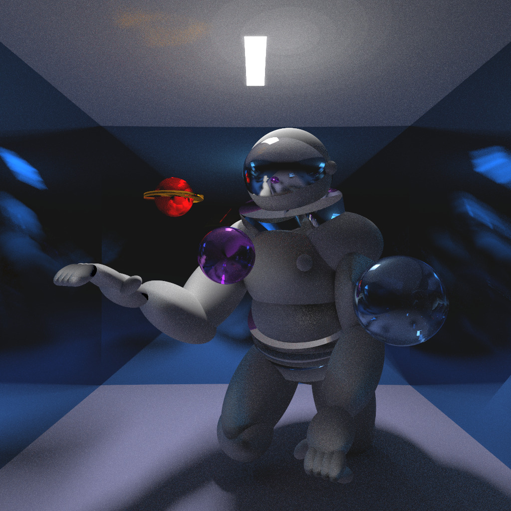

# Computer-Graphics-4th-Year-Course
All Computer Graphics assignments

Over the course of 4 months, alongside my partner Reem Al Halabi,
we created numerous scenes using ray tracing and path tracing algorithms.
Thus opening up the world of understanding how graphical images are created
and represented mathematically. 

Methodologies learned and used:
1) Pinhole model 
2) Affine Transforms
3) Homogenous Projection Matrices
4) Forward and Whitted Ray Tracing
5) Area Light Sources
6) Antialiasing
7) Texture Mapping
8) Photon Mapping
9) Depth of Field
10) Path Tracing

Each assignment has their own README file and instructions in order to run them.

